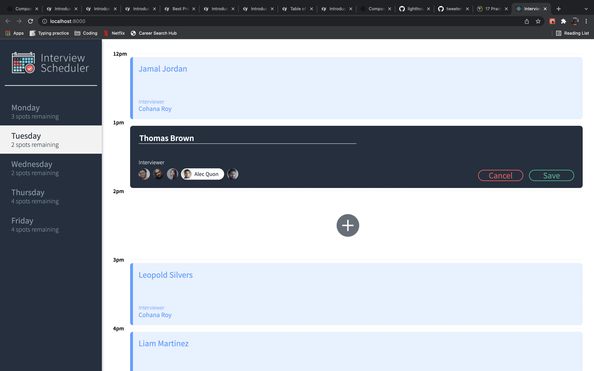
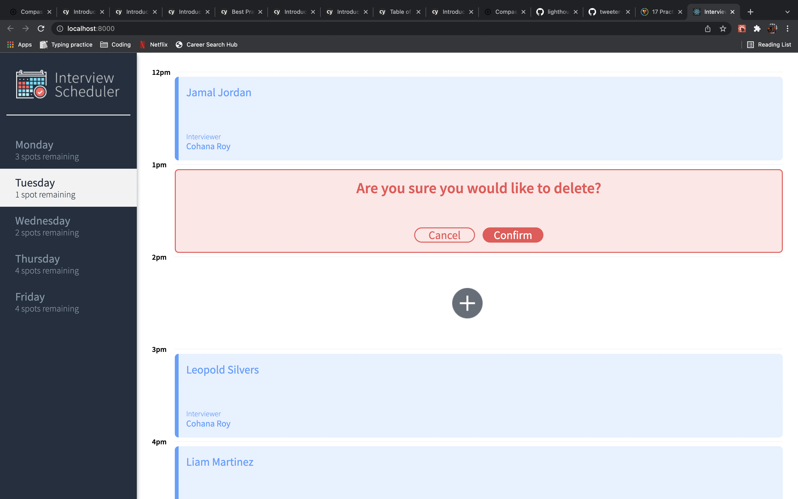
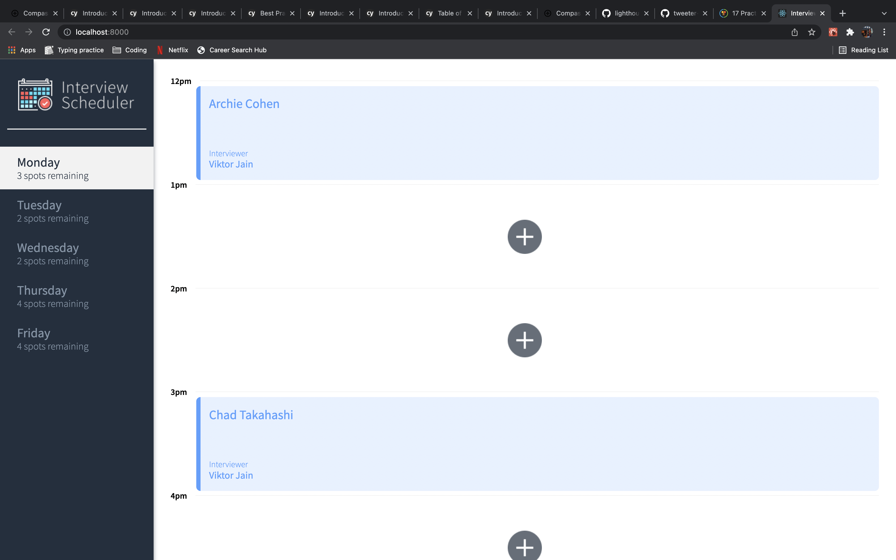

# Interview Scheduler

Interview scheduler is a project created using React.
Screenshots are prvided in the doc directory.

## Setup

Install dependencies with `npm install`.
Also, the app doesn't work with the latest version of Node.js.
`nvm use v15.14.0` to change the version

## Running Webpack Development Server

```sh
npm start
Go to http://localhost:8000/ in your browser.

npm start for scheduler-api
Served at http://localhost:8001

also for error testing
npm run error for scheduler-api
```

## Running Jest Test Framework

```sh
npm test

```

## Running Storybook Visual Testbed

```sh
npm run storybook
```

## Screenshots





## Dependencies

```sh
Axios
Classnames
Normalize.css
React
React-dom
React-scripts
Babel/core
Storybook/addon-actions
Storybook/addon-backgrounds
Storybook/addon-links
Storybook/addons
Storybook/react
Testing-library/jest-dom
Testing-library/react
Testing-library/react-hooks
Babel-loader
Node-sass
Prop-types
React-test-renderer
```
